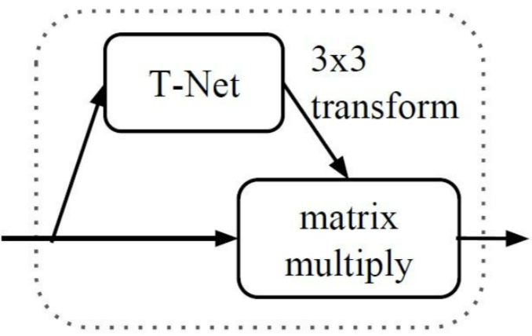
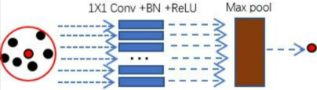
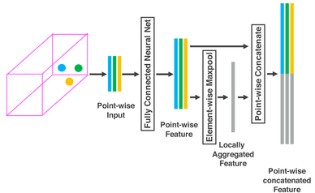
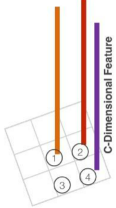

# Point Cloud

## PointNet

来自这篇[知乎](https://zhuanlan.zhihu.com/p/336496973)


1. 变换矩阵（**T-Net**）

为了保证输入点云的**不变性**，作者在进行特征提取前先对点云数据进行**对齐操作**：因为点云从各个方向上观测虽然不同，但其表示的是同一个物体，因此可以对齐到一个空间上（也就是input transform）。  
**对齐操作**是通过训练一个小型的网络（也就是上图中的T-Net）来得到**转换矩阵**，再将转换矩阵与输入相乘实现的。

```python
class STN3d(nn.Module):
    def __init__(self, channel):
        super(STN3d, self).__init__()
        self.conv1 = torch.nn.Conv1d(channel, 64, 1)
        self.conv2 = torch.nn.Conv1d(64, 128, 1)
        self.conv3 = torch.nn.Conv1d(128, 1024, 1)
        self.fc1 = nn.Linear(1024, 512)
        self.fc2 = nn.Linear(512, 256)
        self.fc3 = nn.Linear(256, 9)
        self.relu = nn.ReLU()

        self.bn1 = nn.BatchNorm1d(64)
        self.bn2 = nn.BatchNorm1d(128)
        self.bn3 = nn.BatchNorm1d(1024)
        self.bn4 = nn.BatchNorm1d(512)
        self.bn5 = nn.BatchNorm1d(256)

    def forward(self, x):
        batchsize = x.size()[0]  # shape (batch_size,3,point_nums)
        x = F.relu(self.bn1(self.conv1(x)))  # shape (batch_size,64,point_nums)
        x = F.relu(self.bn2(self.conv2(x)))  # shape (batch_size,128,point_nums)
        x = F.relu(self.bn3(self.conv3(x)))  # shape (batch_size,1024,point_nums)
        x = torch.max(x, 2, keepdim=True)[0]  # shape (batch_size,1024,1)
        x = x.view(-1, 1024) # shape (batch_size,1024)

        x = F.relu(self.bn4(self.fc1(x)))  # shape (batch_size,512)
        x = F.relu(self.bn5(self.fc2(x)))  # shape (batch_size,256)
        x = self.fc3(x)  # shape (batch_size,9)

        """
        最终的 3*3变换矩阵 是要与 n*3的点云矩阵 相乘来实现变换的，而实际上其定义变换乘法是：
        输入 矩阵乘 变换矩阵 + 输入(添加恒等变换)，这个恒等变换是通过在中间矩阵添加iden实现的
        """ 
        # iden表示一个对角阵(1填充的)
        iden = Variable(torch.from_numpy(np.array([1, 0, 0, 0, 1, 0, 0, 0, 1]).astype(np.float32))).view(1, 9).repeat(
            batchsize, 1)  # shape (batch_size,9)
        if x.is_cuda:
            iden = iden.cuda()
        # that's the same thing as adding a diagonal matrix(full 1)
        x = x + iden  # iden means that add the input-self
        x = x.view(-1, 3, 3) # shape (batch_size,3,3)
        return x  # 得到的x是变换矩阵3*3
```

和上面的input transform矩阵的获取方式类似，feature transform的`64*64`矩阵获取代码实现如下：

```python
class STNkd(nn.Module):
    def __init__(self, k=64):
        super(STNkd, self).__init__()
        self.conv1 = torch.nn.Conv1d(k, 64, 1)
        self.conv2 = torch.nn.Conv1d(64, 128, 1)
        self.conv3 = torch.nn.Conv1d(128, 1024, 1)
        self.fc1 = nn.Linear(1024, 512)
        self.fc2 = nn.Linear(512, 256)
        self.fc3 = nn.Linear(256, k * k)
        self.relu = nn.ReLU()

        self.bn1 = nn.BatchNorm1d(64)
        self.bn2 = nn.BatchNorm1d(128)
        self.bn3 = nn.BatchNorm1d(1024)
        self.bn4 = nn.BatchNorm1d(512)
        self.bn5 = nn.BatchNorm1d(256)

        self.k = k

    def forward(self, x):
        batchsize = x.size()[0]
        x = F.relu(self.bn1(self.conv1(x)))
        x = F.relu(self.bn2(self.conv2(x)))
        x = F.relu(self.bn3(self.conv3(x)))
        x = torch.max(x, 2, keepdim=True)[0]
        x = x.view(-1, 1024)

        x = F.relu(self.bn4(self.fc1(x)))
        x = F.relu(self.bn5(self.fc2(x)))
        x = self.fc3(x)

        iden = Variable(torch.from_numpy(np.eye(self.k).flatten().astype(np.float32))).view(1, self.k * self.k).repeat(
            batchsize, 1)
        if x.is_cuda:
            iden = iden.cuda()
        x = x + iden
        x = x.view(-1, self.k, self.k)
        return x
```

其在**分割**任务上的还原过程：

这个`n*1088`的张量由两部分组成，一个是**特征提取网络的输出**（大小为`n*64`）,另一个是通过maxpooling后的global feature（大小为1024），在进行两者融合的时候，对global feature进行了广播，那么`64+1024`就是`1088`了。为什么要这么做呢？:答案就是作者想要融合**点的特征信息**（来自特征提取网络的输出）与**全局特征**（来自global feature）。

> **缺点**：一直在通过mlp进行单个点内的信息交互，最后通过Max Pooling只进行了一次全局信息的交互，缺少中间尺度的信息交互(如CNN中的逐尺度下采样特征提取)，缺少局部特征信息。

👇

## PointNet++

> **Sampling Layer + Grouping Layer**  

### **最远点采样算法(FPS)**来实现从`N`个点中采样`N'`个点👉**Sampling Layer**

1. 随机选择一个点作为**初始点**作为**已选择采样点**
2. 计算**未选择采样点集**中每个点与**已选择采样点集**之间的距离distance，将**距离最大**的那个点加入已选择采样点集
3. 更新distance，一直循环迭代下去，直至获得了目标数量的采样点。

```python
def farthest_point_sample(xyz, npoint):
    """
    Input:
        xyz: pointcloud data, [B, N, 3]
        npoint: number of samples
    Return:
        centroids: sampled pointcloud index, [B, npoint]
    """
    device = xyz.device
    B, N, C = xyz.shape  # (B, N, 3)
    centroids = torch.zeros(B, npoint, dtype=torch.long).to(device)  # 初始化目标采样点(B, npoint)
    distance = torch.ones(B, N).to(device) * 1e10  # (B, N)
    farthest = torch.randint(0, N, (B,), dtype=torch.long).to(device)  # (B,)表示在batch中的 每一个样本 里随机初始化一个点作为基准(包含的是最远点的idx)
    batch_indices = torch.arange(B, dtype=torch.long).to(device)  # 等于在切片中直接写":"
    for i in range(npoint):
        centroids[:, i] = farthest  # (b, npoint)
        centroid = xyz[batch_indices, farthest, :].view(B, 1, 3)  # (B, 3) -> (B, 1, 3)
        dist = torch.sum((xyz - centroid) ** 2, -1)  # (B, N, 3) - (B, 1, 3) -> dist(B, N):选出来的点与所有点的最小二乘(包含的是当前点与所有点的距离)
        mask = dist < distance  # 你与上一个最远点的距离肯定是大于当前计算的所有的dist，因此上一个最远点处会被标为false，避免选点来回在两个最远点之间跳摆。看下方示例👇
        distance[mask] = dist[mask]  # 更新distance为排除所选最远点之后的值
        farthest = torch.max(distance, -1)[1]  # 取[1]是因为返回结果元组中的第二项是idx
    return centroids
#  当B=4， N=5, npoint=3时的结果
>>👇
farthest0:                                  farthest1:
tensor([0, 3, 4, 2])                        tensor([1, 0, 1, 0])
dist:                                       dist:
tensor([[   0, 9821, 4853, 5709, 4358],     tensor([[9821,    0, 5082, 1856, 9011],
        [1787,  708, 1469,    0, 1217],             [   0, 3955, 3362, 1787, 1702],
        [7178, 9595, 8797, 4309,    0],             [4497,    0,  694, 1314, 9595],
        [3924,  801,    0, 1294,  152]])            [   0, 3589, 3924, 1986, 3948]])
mask:                                       mask:#可看到上一次选过的点处已经被标为了False
tensor([[True, True, True, True, True],     tensor([[False,  True, False,  True, False],
        [True, True, True, True, True],             [ True, False, False, False, False],
        [True, True, True, True, True],             [ True,  True,  True,  True, False],
        [True, True, True, True, True]])            [ True, False, False, False, False]])
distance:                                   distance:
tensor([[   0, 9821, 4853, 5709, 4358],     tensor([[   0,    0, 4853, 1856, 4358],
        [1787,  708, 1469,    0, 1217],             [   0,  708, 1469,    0, 1217],
        [7178, 9595, 8797, 4309,    0],             [4497,    0,  694, 1314,    0],
        [3924,  801,    0, 1294,  152]])            [   0,  801,    0, 1294,  152]])

farthest2:
tensor([2, 2, 0, 3])
dist:
tensor([[ 4853,  5082,     0,  6410, 12753],
        [ 3362,  3413,     0,  1469,  5022],
        [    0,  4497,  2379,  3681,  7178],
        [ 1986,   321,  1294,     0,  1126]])
mask:
tensor([[False, False,  True, False, False],
        [False, False,  True, False, False],
        [ True, False, False, False, False],
        [False,  True, False,  True, False]])
distance:
tensor([[   0,    0,    0, 1856, 4358],
        [   0,  708,    0,    0, 1217],
        [   0,    0,  694, 1314,    0],
        [   0,  321,    0,    0,  152]])
```

👇  
**如何将点集划分为不同的区域，并获取不同区域的局部特征？**

### Ball query(group策略)👉**Grouping Layer**

1. 预设**搜索区域**的半径`R`与**子区域**的点数`K`
2. 根据上面提取的`N'`确定centriods数量，以`N'`个点为球心，画半径为`R`的球体（叫做`query ball`，也就是搜索区域）。
3. 在每个以centriods的球心的球体内搜索离centriods最近的的点（按照距离从小到大排序，找到`K`个点）。如果`query ball`的点数量大于点数`K`，那么直接取前`K`个作为子区域；(**如果小于，那么直接对某个点重采样，凑够规模`K`**不是很理解如何重采样)

👇  

### 进行局部特征的提取 **Set Abstraction(SA)**

> 通过Sample layer和Grounping layer后，网络后面紧跟着一个pointnet来进行区域特征提取  
  
作者将max pool用在子区域上，实现**区域**特征提取  
`Sample layer/Grounping layer/Pointnet`（三个合在一起叫做`set abstraction`）

一个`set abstraction`代码如下：

```python
def square_distance(src, dst):  # new_xyz(centroieds)[B, S, C]  xyz[B, N, C]
    """
    Calculate Euclid distance between each two points.

    src^T * dst = xn * xm + yn * ym + zn * zm;
    sum(src^2, dim=-1) = xn*xn + yn*yn + zn*zn;
    sum(dst^2, dim=-1) = xm*xm + ym*ym + zm*zm;
    dist = (xn - xm)^2 + (yn - ym)^2 + (zn - zm)^2
         = sum(src**2,dim=-1)+sum(dst**2,dim=-1)-2*src^T*dst

    Input:
        src: source points, [B, N, C]
        dst: target points, [B, M, C]
    Output:
        dist: per-point square distance, [B, N, M]
    """
    B, N, _ = src.shape
    _, M, _ = dst.shape

    #  (src-dst)**2
    dist = -2 * torch.matmul(src, dst.permute(0, 2, 1))  # -2src*dst  (B, S, C)MM(B, C, N)->(B, S, N)
    dist += torch.sum(src ** 2, -1).view(B, M, 1)  # src**2  (B, S)->(B, S, 1) + (B, S, N)
    dist += torch.sum(dst ** 2, -1).view(B, 1, N)  # dst**2  (B, N)->(B, 1, N) + (B, S, N)
    return dist  # (B, S, N)
>>             
  ——————>     S1 S2     dist*(-2)       P^2[3, 1]    S^2[1, 2]        final_dist[B, 3, 2]
  P1@ @ @      * *|      @* @*              (Σ@^2)                   (@*+Σ@^2+Σ*^2, @*+Σ@^2+Σ*^2)
  P2@ @ @  MM  * *|  ->  @* @*  *(-2)  -> + (Σ@^2)  + (Σ*^2, Σ*^2) ->(@*+Σ@^2+Σ*^2, @*+Σ@^2+Σ*^2)
  P3@ @ @      * *↓      @* @*              (Σ@^2)                   (@*+Σ@^2+Σ*^2, @*+Σ@^2+Σ*^2)

def query_ball_point(radius, nsample, xyz, new_xyz):#  这里官方源代码中有误，做了一些更改
    """
    Input:
        radius: local region radius
        nsample: max sample number in local region
        xyz: all points, [B, N, 3]
        new_xyz: query points, [B, S, 3]
    Return:
        group_idx: grouped points index, [B, S, nsample]
    """
    device = xyz.device
    B, N, C = xyz.shape
    _, S, _ = new_xyz.shape
    # group_idx = torch.arange(N, dtype=torch.long).to(device).view(1, 1, N).repeat([B, S, 1])

    sqrdists = square_distance(new_xyz, xyz)  # (B, S, N)每个采样中心到各个点的欧式距离的平方

    # (B, S, N) group_idx其中的值为0~N-1
    sort_dis, group_idx = sqrdists.sort(dim=-1)  # group_idx(B, S, N)升序排序后的group_idx
    group_idx[sort_dis > radius ** 2] = N  # 索引的范围为0~N-1，所以N是不存在的，因此可将超出范围的idx置为N
    group_idx = group_idx[:, :, :nsample]  # (B, S, nsample)其中最后几个idx有可能是N(group中点不足)

    # 👇当group中的点不足nsample个时，使用离采样中心最近的点来填充
    # 构建一个由当前batch中距离每一个样本中心最近的点(first point)填充的矩阵(B, S, nsample)
    group_first = group_idx[:, :, 0].view(B, S, 1).repeat([1, 1, nsample])
    # 从排序且筛选nsample项的groupe_idx中找出所有idx为N的点
    mask = group_idx == N
    # 将排序且筛选nsample项的groupe_idx中的idx为N的点替换为first point的idx
    group_idx[mask] = group_first[mask]  
    return group_idx

def index_points(points, idx):
    """
    Input:
        points: input points data, [B, N, C]
        idx: sample index data, [B, S]
    Return:
        new_points:, indexed points data, [B, S, C]
    """
    device = points.device
    B = points.shape[0]
    view_shape = list(idx.shape)  # [B, S]
    view_shape[1:] = [1] * (len(view_shape) - 1)
    repeat_shape = list(idx.shape)  # [B, S]
    repeat_shape[0] = 1  # [1, S]
    batch_indices = torch.arange(B, dtype=torch.long).to(device).view(view_shape).repeat(repeat_shape)
    new_points = points[batch_indices, idx, :]
    return new_points
>>  # 解释一下batch_indices中的view和repeat：
以下面的为例：
    a = torch.randint(0, 8, (3, 3, 4))  # 表示原点集B=3, N=3, C=4
    idx2 = torch.tensor([[0, 1], [1, 2], [0, 2]])  # 表示farthest采样出来的centroieds的idx,形状为(B, S)在这个例子中S=2
    idx = torch.arange(3).view((3, 1)).repeat(1, 2)  # 表示将idx:[0, 1, ..., B-1]view与repeat后idx的形状为(B, S),目的是与第二维度索引形状相同，这样才能对应位置索引到点集。

a:                        idx：           
tensor([[[2, 7, 3, 6],    tensor([[0, 0],                 
         [6, 4, 4, 4],            [1, 1],                 
         [1, 6, 0, 2]],           [2, 2]])                  
                          idx[2]:        
        [[7, 2, 6, 2],    tensor([[0, 1],                 
         [0, 1, 6, 1],            [1, 2],                 
         [1, 5, 3, 6]],           [0, 2]])                   
                                    
        [[3, 1, 4, 0],                    
         [0, 0, 7, 3],                                    
         [0, 3, 7, 3]]])                  
                                                       
                                    
a[idx, idx2, :]:  # (B, S, C)                                         
tensor([[[2, 7, 3, 6],                                     
         [6, 4, 4, 4]],                            
                                    
        [[0, 1, 6, 1],                    
         [1, 5, 3, 6]],                                    
                                                  
        [[3, 1, 4, 0],
         [0, 3, 7, 3]]])

def sample_and_group(npoint, radius, nsample, xyz, points, returnfps=False):
    """
    Input:
        npoint:
        radius:
        nsample:
        xyz: input points position data, [B, N, 3]
        points: input points data, [B, N, D]
    Return:
        new_xyz: sampled points position data, [B, npoint, nsample, 3]
        new_points: sampled points data, [B, npoint, nsample, 3+D]
    """
    B, N, C = xyz.shape
    S = npoint
    fps_idx = farthest_point_sample(xyz, npoint) # [B, npoint, C]
    new_xyz = index_points(xyz, fps_idx)  # [B, S, C]
    idx = query_ball_point(radius, nsample, xyz, new_xyz)
    grouped_xyz = index_points(xyz, idx) # [B, npoint, nsample, C]
    grouped_xyz_norm = grouped_xyz - new_xyz.view(B, S, 1, C)

    if points is not None:
        grouped_points = index_points(points, idx)
        new_points = torch.cat([grouped_xyz_norm, grouped_points], dim=-1) # [B, npoint, nsample, C+D]
    else:
        new_points = grouped_xyz_norm
    if returnfps:
        return new_xyz, new_points, grouped_xyz, fps_idx
    else:
        return new_xyz, new_points

class PointNetSetAbstraction(nn.Module):
    def __init__(self, npoint, radius, nsample, in_channel, mlp, group_all):
        super(PointNetSetAbstraction, self).__init__()
        self.npoint = npoint
        self.radius = radius
        self.nsample = nsample
        self.mlp_convs = nn.ModuleList()
        self.mlp_bns = nn.ModuleList()
        last_channel = in_channel
        for out_channel in mlp:
            self.mlp_convs.append(nn.Conv2d(last_channel, out_channel, 1))  # 虽然Conv2d，但是1* 1的卷积😵
            self.mlp_bns.append(nn.BatchNorm2d(out_channel))
            last_channel = out_channel
        self.group_all = group_all

    def forward(self, xyz, points):
        """
        Input:
            xyz: input points position data, [B, C, N]
            points: input points data, [B, D, N]
        Return:
            new_xyz: sampled points position data, [B, C, S]
            new_points_concat: sample points feature data, [B, D', S]
        """
        xyz = xyz.permute(0, 2, 1)  # (B, N, C)
        if points is not None:
            points = points.permute(0, 2, 1)  # (B, N, D)

        if self.group_all:
            new_xyz, new_points = sample_and_group_all(xyz, points)  # 采样覆盖所有点
        else:
            new_xyz, new_points = sample_and_group(self.npoint, self.radius, self.nsample, xyz, points)
        # new_xyz: sampled points position data, [B, npoint, C]
        # new_points: sampled points data, [B, npoint, nsample, C+D]
        new_points = new_points.permute(0, 3, 2, 1) # [B, C+D, nsample, npoint]
        for i, conv in enumerate(self.mlp_convs):
            bn = self.mlp_bns[i]
            new_points =  F.relu(bn(conv(new_points)))

        new_points = torch.max(new_points, 2)[0]
        new_xyz = new_xyz.permute(0, 2, 1)
        return new_xyz, new_points
```

> **缺点**：来源于sampling和grouping的在遇到**非均匀分布**的点云集合时：
>  
> `It is common that a point set comes with` **nonuniform density** `in` **different areas**  
> `Features learned in` **dense** `data may` **not generalize to** **sparsely** `sampled regions`

于是作者提出了**两种特征融合方式**，分别为：

1. Multi-scale grouping (MSG):是对不同半径的子区域进行特征提取后进行特征堆叠,MSG方法计算量太大，提出来的备选方案MRG
2. Multiresolution grouping (MRG):MRG用两个Pointnet对连续的两层分别做特征提取与聚合，然后再进行特征拼接。


MSG:

```python
  B, N, C = xyz.shape
  S = self.npoint
  new_xyz = index_points(xyz, farthest_point_sample(xyz, S))
  new_points_list = []
  for i, radius in enumerate(self.radius_list):
      K = self.nsample_list[i]
      group_idx = query_ball_point(radius, K, xyz, new_xyz)
      grouped_xyz = index_points(xyz, group_idx)
      grouped_xyz -= new_xyz.view(B, S, 1, C)
      if points is not None:
          grouped_points = index_points(points, group_idx)
          grouped_points = torch.cat([grouped_points, grouped_xyz], dim=-1)
      else:
          grouped_points = grouped_xyz

      grouped_points = grouped_points.permute(0, 3, 2, 1)  # [B, D, K, S]
      for j in range(len(self.conv_blocks[i])):
          conv = self.conv_blocks[i][j]
          bn = self.bn_blocks[i][j]
          grouped_points =  F.relu(bn(conv(grouped_points)))
      new_points = torch.max(grouped_points, 2)[0]  # [B, D', S]
      new_points_list.append(new_points)

  new_xyz = new_xyz.permute(0, 2, 1)
  new_points_concat = torch.cat(new_points_list, dim=1)
```

## VoxelNet

来自[知乎](https://zhuanlan.zhihu.com/p/352419316)

### 特征学习网络

1. **Voxel Partition**：也就是将空间划分为一个个堆叠的、相同大小的Voxel
2. **Grouping**：上面将空间划分为一个个的Voxel了，Grouping这一步的作用就是将3D**点云数据装进这一个个的Voxel中**，实现分组。
3. **Random Sampling**：3D点云的数据量往往都是10万以上的。要是直接在这个数量级上进行特征提取，是非常消耗计算资源的，而且可能会引发检测偏差（bias the detection）。所以作者提出了随机采样方法，将**点云数量超过`T`的Voxel**中的点云数量降至`T`。
4. **Stacked Voxel Feature Encoding**：这一步是最重要的一步。作者在这一步提出了VFE层（VFE= Voxel Feature Encoding）。我相信作者提出这个层，应该是受到了PointNet的启发。这里我们给出这个层的实现图
  
    1. 上图中Voxel有**3个**点云数据。作者先用一个FCN层(**逐点计算**，并没有引入点与点之间的关系，也就是local feature，所以FCN指的是全连接层)
    作者在此基础上引入**Element-wise maxpool**，获得**Locally Aggregated Feature**。Locally Aggregated Feature反应了这些点的一个局部关系。(对应上图中第二个白框)  
    2. 作者将Point-wise Feature和Locally Aggregated Feature进行了简单的堆叠融合，作为下一个VFE层的输入。
    这样连续堆叠几次VFE层后，就获得更丰富的特征表示。最后，使用一个Element-wise maxpool**获得最后的一个Voxel-wise Feature**.
      
    `->`  
4中的代码实现：

```python
# Fully Connected Network
class FCN(nn.Module):
    def __init__(self, cin, cout):
        super(FCN, self).__init__()
        self.cout = cout
        # 定义全连接层
        self.linear = nn.Linear(cin, cout)
        # 定义批量归一化层
        self.bn = nn.BatchNorm1d(cout)

    def forward(self, x):  # x(KK, t, C)
        # 获取输入张量的形状
        # KK is the stacked k across batch(每一个batch中包含了多少个voxel)
        kk, t, _ = x.shape
        # 将输入张量视图重塑为二维张量
        x = self.linear(x.view(kk * t, -1))  # 当前batch中有kk* t个点，view成变成(kk*t， C)送入FCN
        # 对全连接层的输出进行批量归一化和ReLU激活
        x = F.relu(self.bn(x))
        # 将输出张量再次重塑为三维张量
        return x.view(kk, t, -1)

# Voxel Feature Encoding layer
class VFE(nn.Module):

    def __init__(self, cin, cout):
        super(VFE, self).__init__()
        assert cout % 2 == 0
        self.units = cout // 2
        self.fcn = FCN(cin, self.units)

    def forward(self, x, mask):  # x(KK, t, C) 其中：mask = torch.ne(torch.max(x,2)[0], 0)在SVFE中有定义
        # 那么mask的形状为(KK, T)，用于筛选掉voxel中不包含点的位置(batch中有KK个voxel，其中voxel不包含点的位置在dim=2中一定全为0，最大值一定为0)
        # point-wise feauture
        pwf = self.fcn(x)  # (KK, t, C)
        #locally aggregated feature
        laf = torch.max(pwf, 1)[0].unsqueeze(1).repeat(1, cfg.T, 1)  # (KK, t, C)->(KK, 1, C)->(KK, T, C)
        # point-wise concat feature
        pwcf = torch.cat((pwf, laf),dim=2)  # concat(KK, t, cout//2)(KK, T, cout//2)->(KK, T, cout)
        # apply mask
        mask = mask.unsqueeze(2).repeat(1, 1, self.units * 2)  # (KK, T)->(KK, T, 1)->(KK, T, cout)
        pwcf = pwcf * mask.float()  # (KK, T, cout)* (KK, T, cout) -> (KK, T, cout)

        return pwcf  # (KK, T, cout)

# Stacked Voxel Feature Encoding
class SVFE(nn.Module):

    def __init__(self):
        super(SVFE, self).__init__()
        self.vfe_1 = VFE(7,32)
        self.vfe_2 = VFE(32,128)
        self.fcn = FCN(128,128)
    def forward(self, x):  # (KK, T, 7)
        mask = torch.ne(torch.max(x,2)[0], 0)
        x = self.vfe_1(x, mask)  # (KK, T, 32)
        x = self.vfe_2(x, mask)  # (KK, T, 128)
        x = self.fcn(x)  # (KK, T, 128)
        # element-wise max pooling
        x = torch.max(x,1)[0]  # (KK, 1, 128)->(KK, 128)
        return x  # (KK, 128)
```

### 卷积层Convolutional Middle Layer(CML)

> 在所有Voxel中做3d卷积，进一步扩大感受野，增加更多的信息描述。

点云数据通过特征学习网络后可以被表示成一个**稀疏的4D张量**, 维度记做(C, D(epth), H(eight), W(idth))  
其中`C`为Voxel-wise Feature的向量维度(即SVFE得到的`128`维特征), `D, H, W`分别为空间的深度、高度和宽度（**单位为Voxel数量**）  

```python
# Convolutional Middle Layer
class CML(nn.Module):
    def __init__(self):
        super(CML, self).__init__()
        self.conv3d_1 = Conv3d(128, 64, 3, s=(2, 1, 1), p=(1, 1, 1))  # (128, D, H, W)->(64, D/2, H, W)
        self.conv3d_2 = Conv3d(64, 64, 3, s=(1, 1, 1), p=(0, 1, 1))  # (64, D/2 - 2, H, W)
        self.conv3d_3 = Conv3d(64, 64, 3, s=(2, 1, 1), p=(1, 1, 1))  # (64, D/4 - 1, H, W)

    def forward(self, x):  # 输入x的形状为(C, D, H, W)
        x = self.conv3d_1(x)
        x = self.conv3d_2(x)
        x = self.conv3d_3(x)
        return x  # (64, D/4 - 1, H, W)
```
